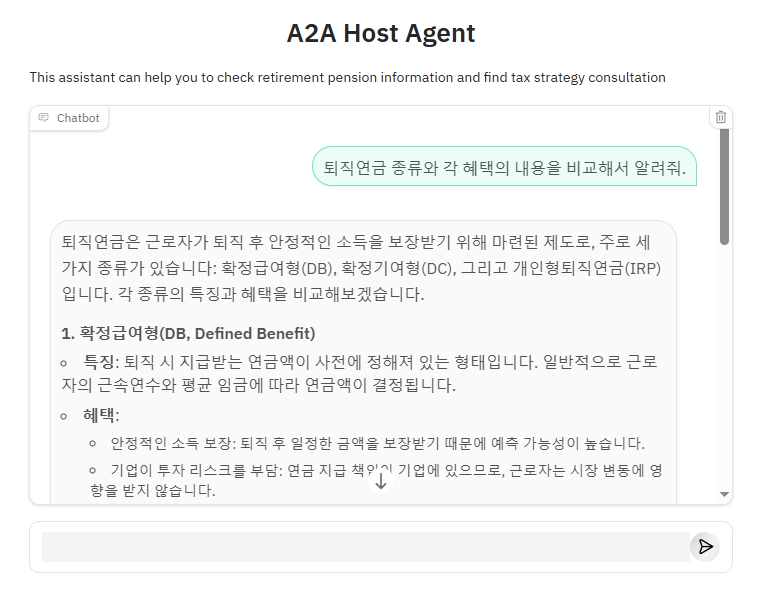

# A2A를 활용한 퇴직연금 멀티 에이전트

## Overview
프로젝트의 통일성 및 확장성을 위해 a2a-sdk를 활용하여 각 에이전트를 연결하였습니다.

## Agents

1. host_agent : 사용자의 입력을 토대로 각 에이전트의 작업을 조정하는 Agent
2. info_agent : 퇴직연금 관련 정보 및 혜택에 대한 정보를 제공하는 RAG 기반 Agent
3. tax_strategy_agent : 절세 전반의 정보를 제공하는 RAG 기반 Agent
4. report_agent : 금융 문서 분석 및 실시간 시장 정보를 요약하여 금융 보고서를 자동으로 생성하는 Agent
5. Pension Analytics Agent (추후 연결 예정) : 퇴직연금 계좌를 분석하여 맞춤형 투자 전략, 수익률 분석, 세금 최적화 등을 진행하는 Agent

## Demo UI


현재 Gradio를 사용해 demo로 연결해두었습니다. 추후 프로젝트의 Frontend와 연결할 예정입니다.

## Setup

1. **Prerequisites:**
   - Python 3.10+
   - uv: The Python package management tool used in this project.
   ```bash
   pip install uv
   ```

2. **Install dependencies:**
   ```bash
   pip install -r requirements.txt
   ```

3. **Configure environment variables:**
   - Create an `.env` file in 'info_agent' directory:
   ```bash
   cd info_agent
   touch .env
   ```
   Then update the .env file to specify your API Key:
   ```
   GOOGLE_API_KEY=your_google_api_key
   OPENAI_API_KEY=your_openai_api_key
   UPSTAGE_API_KEY=your_upstage_api_key
   ```
   - Create an `.env` file in 'report_agent':
   ```bash
   cd ../report_agent
   touch .env
   ```
   Then update the .env file to specify your API Key:
   ```
   GOOGLE_API_KEY=your_google_api_key
   OPENAI_API_KEY=your_openai_api_key
   UPSTAGE_API_KEY=your_upstage_api_key
   TAVILY_API_KEY=your_tavily_api_key
   OPENROUTER_API_KEY=your_openrouter_api_key
   ```
   - Create an `.env` file in 'tax_strategy_agent':
   ```bash
   cd ../tax_strategy_agent
   touch .env
   ```
   Then update the .env file to specify your API Key:
   ```
   GOOGLE_API_KEY=your_google_api_key
   OPENAI_API_KEY=your_openai_api_key
   ```
   - Create an `.env` file in 'host_agent':
   ```bash
   cd ../host_agent
   touch .env
   ```
   ```
   GOOGLE_API_KEY=your_google_api_key
   INFO_AGENT_URL=http://localhost:10000
   TAX_AGENT_URL=http://localhost:10001
   REPORT_AGENT_URL=http://localhost:10002
   ```

4. **Run Each Agent:**
   - info_agent:
   Open a new terminal and run the info_agent:
   ```bash
   cd ../info_agent
   uv run .
   ```
   - report_agent:
   Open a new terminal and run the report_agent:
   ```bash
   cd ../report_agent
   uv run .
   ```
   - tax_strategy_agent:
   Open a new terminal and run the tax_strategy_agent:
   ```bash
   cd ../tax_strategy_agent
   uv run .
   ```

5. **Run Host Agent:**
   - host_agent:
   Open a new terminal and run the host agent server:
   ```bash
   cd ../host_agent
   uv run .
   ```

6. **Test using the UI:**
   - From your browser, navigate to http://0.0.0.0:8083.
   
   Here are example questions:
   - "퇴직연금 종류와 각 혜택의 내용을 비교해서 알려줘."
   - "IRP에 추가 납입하면 세금 혜택이 어떻게 되나요?"

## References
- https://github.com/a2aproject/a2a-samples/blob/main/samples/python/agents/airbnb_planner_multiagent
- https://github.com/google/a2a-python
