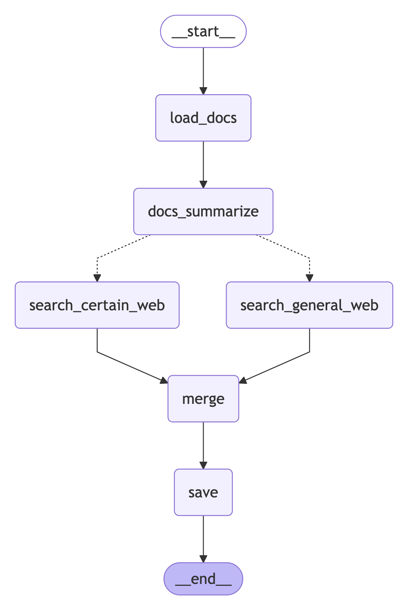

# Financial Report Generation Pipeline



## Overview

This project delivers an advanced, modular pipeline for automated financial report generation, tailored for Korean investors. Leveraging LangGraph and LangChain, it integrates daily financial document analysis, real-time web search, and AI-powered summarization to produce comprehensive, actionable reports.

## Key Features

- **Automated Document Parsing** with Upstage
- **Fast Retrieval** using Chroma vector database
- **Real-Time Market Insights** via Tavily web search
- **AI Summarization** powered by Claude 3.7
- **Modular, Extensible Pipeline** built with LangGraph

## Prerequisites

- Python 3.11+
- OpenAI API key
- Tavily API key
- Ollama (for embeddings)

## Installation

1. **Clone the repository:**

2. **Install dependencies:**
   ```bash
   pip install -r requirements.txt
   ```

3. **Configure environment variables:**
   Create an `openai.env` file with your API keys:
   ```
   OPENAI_API_KEY=your_openai_api_key
   TAVILY_API_KEY=your_tavily_api_key
   ```
> **Note:** Prepare a `.env` or `openai.env` file with required API keys.

## Project Structure

```
.
├── data/                          # PDF document storage
├── cache_db/                      # Vector database files
├── reports/                       # Generated reports
├── financial_report_pipeline.py   # Main pipeline logic
├── store_docs.py                  # Document fetching utilities
└── requirements.txt               # Dependency list
```

## Pipeline Components

1. **Document Loading (`load_docs`)**
   - Initializes pipeline state and checks Chroma for existing documents.
   - Fetches and vectorizes new documents as needed.

2. **Document Summarization (`summarize_documents`)**
   - Applies map-reduce summarization to document sections.
   - Produces comprehensive summaries and saves intermediate results.

3. **Web Search (`search_general_web` / `search_certain_web`)**
   - Conducts real-time market research via Tavily.
   - Supports both general and targeted queries.
   - Summarizes market insights.

4. **Output Merging (`merge_outputs`)**
   - Integrates document and web summaries.
   - Produces structured, actionable financial reports.

5. **Report Saving (`save_output`)**
   - Saves final reports in markdown format, organized by date.
   - Maintains a historical archive.

## Usage

1. **Run the pipeline:**
   ```python
   from financial_report_pipeline import adaptive_rag

   inputs = {
       "date": date.today().isoformat(),
       "query": "오늘의 금융 보고서를 작성해주세요",
       "documents": [],
       "doc_summary_chunks": [],
       "doc_summary": "",
       "web_summary": "",
       "final_output": "",
       "db_path": "cache_db"
   }

   final_output = adaptive_rag.invoke(inputs)
   ```

2. **Access generated reports** in the `reports/` directory:
   - `middle_report_doc_summary_[date].md`: Document summaries
   - `middle_report_general_search_[date].md`: Market insights
   - `final_report_[date].md`: Final comprehensive report

## Report Structure

Each report follows a standardized format:

1. **금융 시장 동향** (Financial Market Trends)
   - 주요 지표 및 추세 (Key Indicators and Trends)
   - 소비 심리 분석 (Consumer Sentiment Analysis)
   - 시장 동향 (Market Trends)

2. **투자 전략 시사점** (Investment Strategy Implications)
   - 기회 요인 (Bullish Signals)
   - 리스크 요인 (Bearish Signals)

3. **투자 Action Point** (Investment Action Points)
   - 채권 (Bonds)
   - 주식 (Stocks)
   - 섹터 회피 (Sectors to Avoid)
   - ETF 제안 (ETF Recommendations)
   - 환율 전략 (Currency Strategy)

4. **전략적 제언** (Strategic Recommendations)
   - 시장 전망 요약 (Market Outlook Summary)
   - 포트폴리오 구성 방향 (Portfolio Allocation)
   - 주의해야 할 점 (Points of Caution)

---

## FastAPI Integration

A FastAPI server is provided for programmatic access:

### 주요 기능

- **/generate_report** : Generate a tailored financial report by providing a query and date.
- **/download_report/{report_date}** : Download generated reports (.md files).
- **/health** : Server health check.

### 서버 실행

```bash
uvicorn server:app --host 0.0.0.0 --port 8000
```

### 보고서 생성 예시

```http
POST /generate_report
Content-Type: application/json

{
  "query": "오늘의 금융 시장 동향과 투자 전략을 분석하여 보고서를 작성해주세요",
  "date": "2025-05-18"  // (Optional, defaults to today)
}
```

**Response Example:**
```json
{
  "status": "success",
  "report": "오늘의 금융 레포트 ...",
  "date": "2025-05-18"
}
```
**On Error:**
```json
{
  "status": "error",
  "error": "에러 메시지"
}
```

