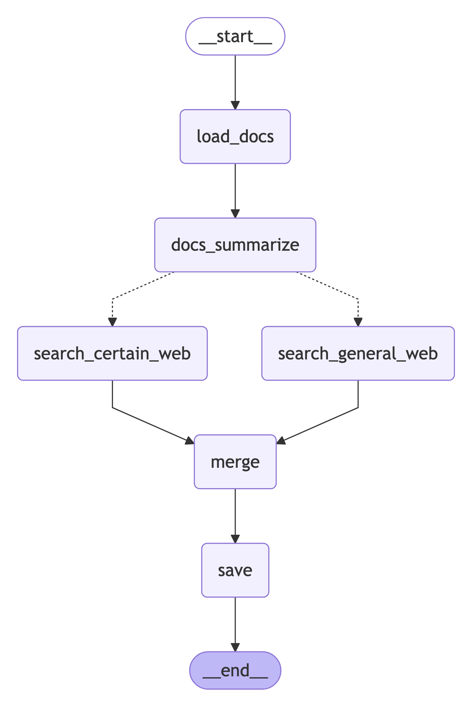

# Financial Report Generation Pipeline



## Overview
This project implements an advanced financial report generation pipeline using LangGraph and LangChain. It combines daily financial document analysis, web search, and AI-powered summarization to create comprehensive financial reports for Korean investors.

## Features
- **Document Processing**: Parses and analyzes financial documents using Upstage's document parser
- **Vector Database Integration**: Uses Chroma for efficient document storage and retrieval
- **Web Search Integration**: Incorporates Tavily search for real-time market insights
- **AI-Powered Summarization**: Utilizes GPT-4 for intelligent document and web content summarization
- **Modular Pipeline**: Implements a flexible graph-based workflow using LangGraph

## Prerequisites
- Python 3.11+
- OpenAI API key
- Tavily API key
- Ollama (for embeddings)

## Installation

1. Clone the repository:
```bash
git clone [repository-url]
cd [repository-name]
```

2. Install dependencies:
```bash
pip install -r requirements.txt
```

3. Set up environment variables:
Create a `openai.env` file with your API keys:
```
OPENAI_API_KEY=your_openai_api_key
TAVILY_API_KEY=your_tavily_api_key
```

## Project Structure
```
.
├── data/                          # Directory for storing PDF documents
├── cache_db/                      # Vector database storage
├── reports/                       # Generated report outputs
├── financial_report_pipeline.py   # Main pipeline implementation
├── store_docs.py                  # Document fetching utilities
└── requirements.txt               # Project dependencies
```

## Pipeline Components

### 1. Document Loading (`load_docs`)
- Initializes the pipeline state
- Checks for existing documents in Chroma database
- Fetches new documents if needed
- Converts documents to vector format

### 2. Document Summarization (`summarize_documents`)
- Implements map-reduce summarization
- Processes each document section
- Generates comprehensive summaries
- Saves intermediate results

### 3. Web Search (`search_general_web`/`search_certain_web`)
- Performs real-time market research
- Supports both general and specific queries
- Integrates with Tavily search API
- Generates market insights summaries

### 4. Output Merging (`merge_outputs`)
- Combines document and web summaries
- Generates structured financial reports
- Includes investment recommendations
- Formats output for easy reading

### 5. Report Saving (`save_output`)
- Saves final reports in markdown format
- Organizes outputs by date
- Maintains report history

## Usage

1. Run the pipeline:
```python
from financial_report_pipeline import adaptive_rag

inputs = {
    "date": date.today().isoformat(),
    "query": "오늘의 금융 보고서를 작성해주세요",
    "documents": [],
    "doc_summary_chunks": [],
    "doc_summary": "",
    "web_summary": "",
    "final_output": "",
    "db_path": "cache_db"
}

final_output = adaptive_rag.invoke(inputs)
```

2. Generated reports will be saved in the `reports/` directory with the following structure:
   - `middle_report_doc_summary_[date].md`: Document summaries
   - `middle_report_general_search_[date].md`: General market insights
   - `final_report_[date].md`: Final comprehensive report

## Report Format

The generated reports follow a structured format:

1. **금융 시장 동향** (Financial Market Trends)
   - 주요 지표 및 추세 (Key Indicators and Trends)
   - 소비 심리 분석 (Consumer Sentiment Analysis)
   - 시장 동향 (Market Trends)

2. **투자 전략 시사점** (Investment Strategy Implications)
   - 기회 요인 (Bullish Signals)
   - 리스크 요인 (Bearish Signals)

3. **투자 Action Point** (Investment Action Points)
   - 채권 (Bonds)
   - 주식 (Stocks)
   - 섹터 회피 (Sectors to Avoid)
   - ETF 제안 (ETF Recommendations)
   - 환율 전략 (Currency Strategy)

4. **전략적 제언** (Strategic Recommendations)
   - 시장 전망 요약 (Market Outlook Summary)
   - 포트폴리오 구성 방향 (Portfolio Allocation)
   - 주의해야 할 점 (Points of Caution)

## Dependencies
- langchain>=0.1.0
- langchain-upstage>=0.0.1
- langchain-community>=0.0.10
- langchain-ollama>=0.0.1
- langchain-openai>=0.0.2
- langgraph>=0.0.10
- chromadb>=0.4.18
- python-dotenv>=1.0.0
- termcolor>=2.4.0
- tavily-python>=0.2.6
- ollama>=0.1.6
